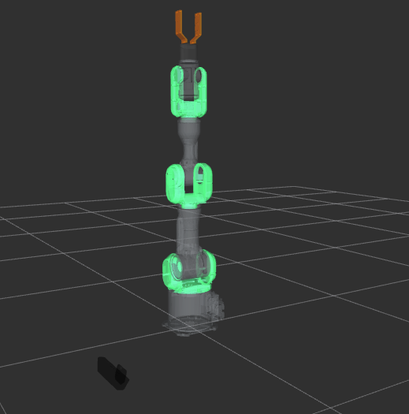

# 🤖 PA-10 Robotic Arm Simulation with Dynamic Control and RViz Visualization

This repository simulates a Mitsubishi PA-10 robotic arm in **ROS 2 Jazzy** using custom dynamic control based on operational space and null-space projection. The system visualizes joint trajectories in **RViz** and can be extended to simulate object pickup via markers.

---

## 🎥 Demo


[](https://github.com/manuelmort/ROS2_Manipulator_Project/blob/main/assets/pa10example.mp4)


## 📦 Features

- Symbolic + numerical dynamic model of the 7-DOF PA-10 arm using `roboticstoolbox`
- Multi-goal joint trajectory execution using `solve_ivp`
- Joint state publishing for real-time RViz visualization
- Modular design with clear separation between dynamics and ROS node
- Marker-based extension support to simulate object grasping in RViz

---

## 🚀 Requirements

- ROS 2 Jazzy
- Python 3.10+
- Dependencies:
  - `rclpy`
  - `roboticstoolbox-python`
  - `spatialmath-python`
  - `scipy`
  - `matplotlib`
  - `numpy`

Install with:

```bash
pip install roboticstoolbox-python spatialmath scipy matplotlib numpy
